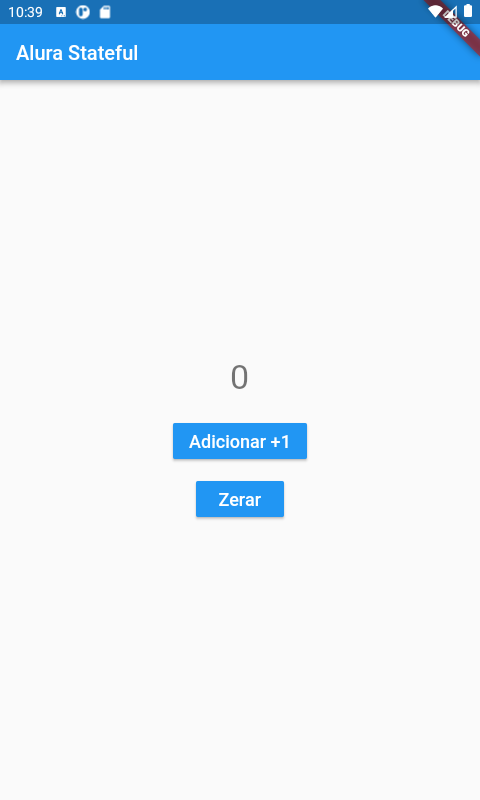

# Alura stateful example

This repository was created with a code developed for explain how we can use stateful widgets with flutter.
Here, we've a code used to explain the differences between stateless and stateful widgets posted at [blog of Alura](https://www.alura.com.br/artigos/).

I wrote this post to help beginers on flutter!

Enjoy! ;)

